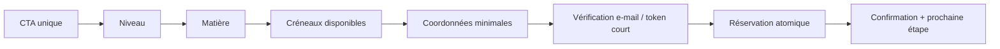
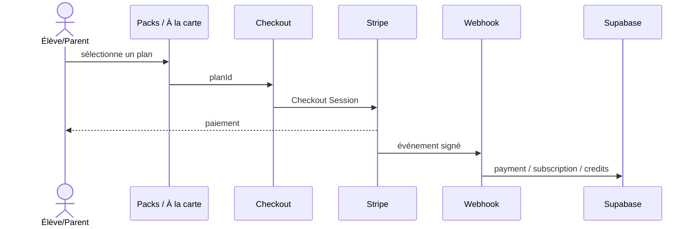
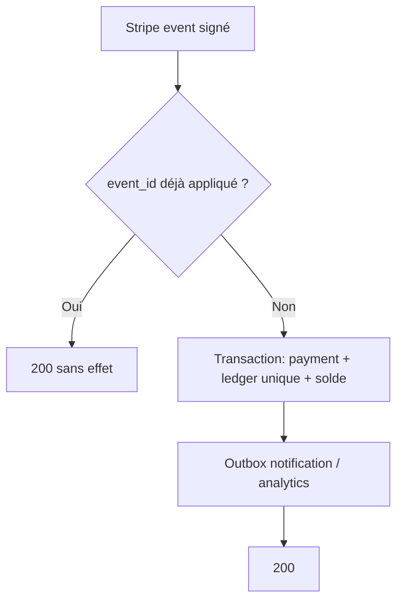
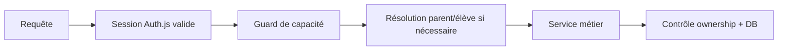
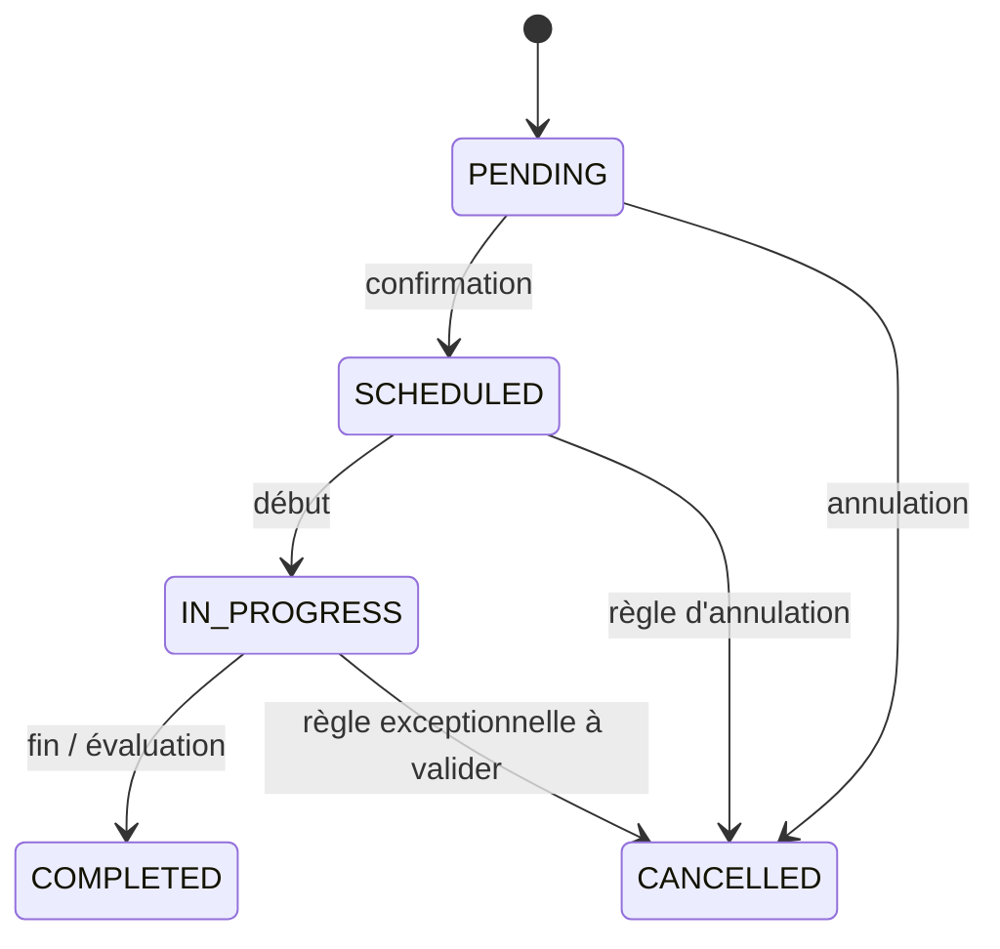

```mermaid
flowchart LR
  A[Homepage / Header / Promo] --> B[LeadCaptureModal]
  B --> C[Niveau + matière + coordonnées]
  C --> D[POST /api/leads]
  D --> E[Compte créé ou modifié]
  E --> F[GET créneaux par matière]
  F --> G[Créneau et tuteur proposés]
  G --> H[POST first-session-slots]
  H --> I[Assignation + séance TRIAL PENDING]
  I --> J[Notifications / e-mail]
```

# Workflows produit et techniques — SikaSchool

## Rôle de ce document

Ce document complète `docs/workflows/` en étant l'**index visuel des parcours** : acteurs, étapes, états et frontières entre workflows. Il ne répète pas les constats ni les solutions détaillées : chaque écart renvoie à son ID dans les audits. L'ordre d'implémentation et les critères de recette contractuels restent dans [ROADMAP.md](ROADMAP.md).

## Réservation d'une première séance

### Workflow actuel

### Écarts référencés

| Écart | Source de détail |
| --- | --- |
| Deux points de contrôle de modale | `UX-001` dans `UX_UI_AUDIT.md` |
| Étapes/formulaire trop chargés | `UX-003` dans `UX_UI_AUDIT.md` |
| Compte existant modifiable par lead | `TECH-001` dans `TECHNICAL_AUDIT.md` |
| Preuve d'identité et concurrence de créneau | `TECH-003` dans `TECHNICAL_AUDIT.md` |
| Calendrier public de démonstration | `TECH-008` dans `TECHNICAL_AUDIT.md` |

### Workflow recommandé

**Décisions métier à valider :** durée de hold, attribution « meilleur tuteur » ou choix explicite, délai de confirmation tuteur, données nécessaires à l'essai, politique d'annulation. Les critères de recette sont centralisés dans `ROADMAP.md` (TECH-001 à TECH-003 et UX-003).

## Achat et crédits Stripe

### Workflow actuel

### Écarts référencés

| Écart | Source de détail |
| --- | --- |
| Comparaison publique des offres | `UX-002` dans `UX_UI_AUDIT.md` |
| Idempotence et atomicité crédits | `TECH-002` dans `TECHNICAL_AUDIT.md` |
| Transition séance/consommation | tâche « Formaliser les transitions » de Phase 4 dans `ROADMAP.md` |

### Workflow recommandé

Les critères de recette paiement sont centralisés dans `ROADMAP.md` sous TECH-002.

## Authentification et autorisation

### État actuel

Les identités et mots de passe sont gérés par Supabase Auth dans `auth.users`. Auth.js fournit la session HttpOnly aux pages et routes Next.js ; les rôles métier proviennent de `public.profiles`. Parent → élève effectif est résolu dans `lib/student-access.ts`. Les routes API conservent leurs contrôles de rôle et de propriété.

### Workflow recommandé

**Règle :** le frontend et middleware améliorent l'expérience ; la route/service vérifie systématiquement la permission et la propriété de la ressource. Les privilèges doivent provenir d'un rôle/permission stocké, non d'une liste d'e-mails.

## Cycle de séance

### États recensés

### Référence d'implémentation

La formalisation des transitions est une tâche unique de Phase 4 dans `ROADMAP.md`; le choix d'un service et d'une machine d'états légère est motivé dans `DESIGN_PATTERNS.md`. Ne pas créer une seconde spécification dans ce document.

## Feedback et observabilité transverses

Références : `A11Y-002` pour les états UI et `TECH-011` pour les événements, logs et corrélation. Les définitions d'événements et critères d'acceptation ne figurent que dans `ROADMAP.md`.
