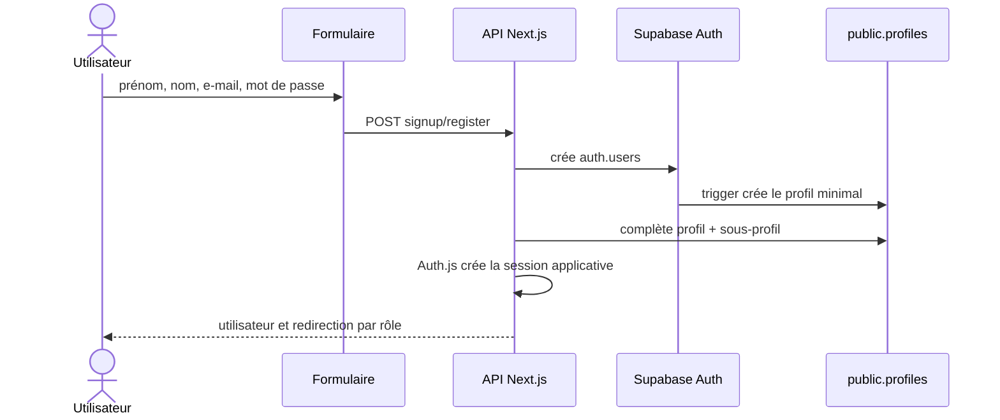
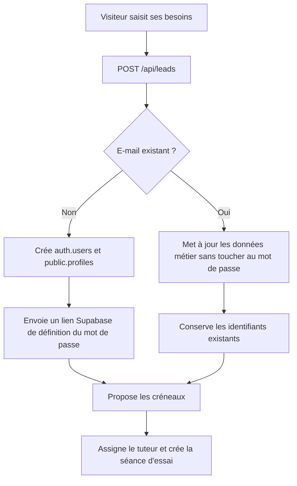
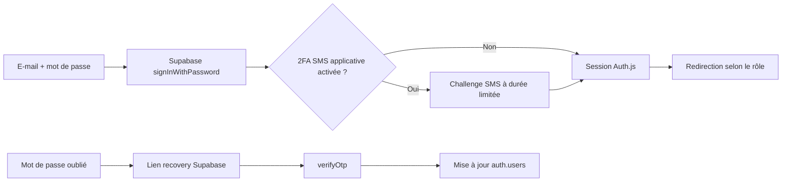

# 01 — Onboarding, authentification et récupération

## Architecture

Supabase Auth est l’unique source de vérité pour l’identité et les mots de passe :

- `auth.users` contient l’identité, l’e-mail confirmé, le hash du mot de passe et l’état de bannissement ;
- `public.profiles` contient uniquement les données métier (`first_name`, `last_name`, rôle, coordonnées, état actif) ;
- `students` et `tutors` complètent le profil selon le rôle ;
- Auth.js crée la session applicative chiffrée et HttpOnly utilisée par les routes Next.js ;
- la session Supabase côté navigateur est conservée pour Realtime et les politiques RLS.

Il ne doit plus exister de mot de passe ou de token de récupération dans le schéma `public`.

## Inscription directe

Entrées : pages `app/(site)/auth/signup`, routes `POST /api/auth/signup` et `POST /api/auth/register`.

Règles :

- e-mail normalisé et unique ; mot de passe de 8 caractères minimum ;
- l’inscription publique autorise seulement `STUDENT` et `PARENT` ;
- les rôles `TUTOR` et `ADMIN` sont créés depuis l’administration ;
- si la création du profil métier échoue, l’identité Auth nouvellement créée est supprimée afin d’éviter un compte incomplet ;
- le trigger Auth ignore tout rôle fourni par le client et crée toujours un profil minimal `STUDENT`. Seul le serveur de confiance peut ensuite attribuer un autre rôle.

## Demande de première séance (lead)

Entrées : `components/Booking/LeadCaptureModal.tsx`, `POST /api/leads`, `GET|POST /api/leads/first-session-slots`.

Un compte créé depuis un lead reçoit un mot de passe aléatoire non communiqué, puis un lien de récupération Supabase lui permet de choisir son propre mot de passe. Aucun mot de passe en clair n’est stocké, journalisé ou envoyé par e-mail.

## Connexion et récupération

| Parcours | Route | Garantie |
| --- | --- | --- |
| Connexion | `POST /api/auth/login` | Supabase vérifie le mot de passe, puis Auth.js ouvre la session |
| Déconnexion | `POST /api/auth/logout` | Ferme la session Auth.js ; le client ferme aussi sa session Supabase |
| Mot de passe oublié | `POST /api/auth/forgot-password` | Réponse non énumérante et lien recovery natif Supabase |
| Réinitialisation | `POST /api/auth/reset-password` | Vérifie le token Supabase puis remplace le mot de passe dans `auth.users` |
| Vérification e-mail | `GET /api/auth/verify-email?token=` | Vérifie un token e-mail Supabase lorsqu’un flux non confirmé est utilisé |

## Tests de recette

- connecter un élève, un parent, un tuteur et un admin, puis vérifier la redirection de rôle ;
- vérifier qu’un compte inactif ou banni ne peut pas se connecter ;
- tester un mauvais mot de passe, un lien recovery expiré et un challenge 2FA expiré ;
- créer un compte public et un compte depuis l’administration, puis contrôler `auth.users`, `profiles` et le sous-profil ;
- vérifier que chaque bouton de déconnexion invalide les sessions Auth.js et Supabase.
