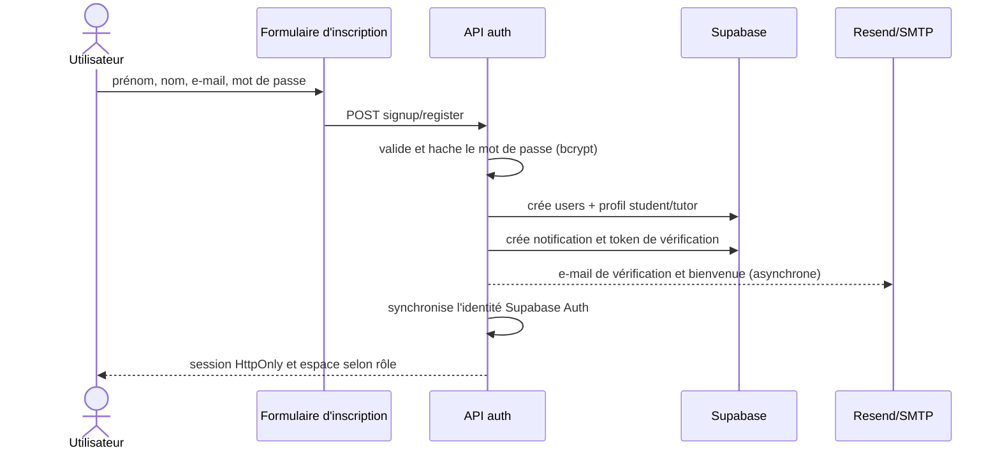
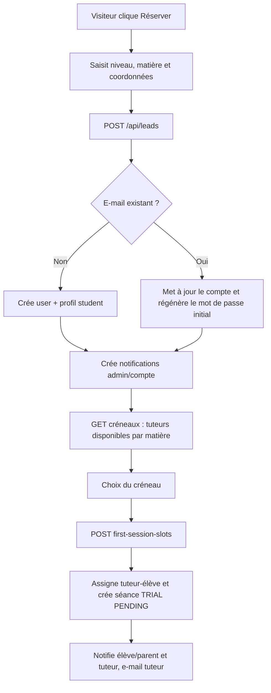
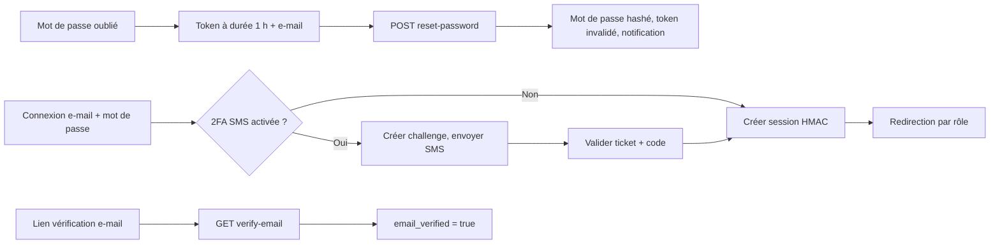

# 01 — Onboarding, inscription et connexion

## Objectif

Créer un compte, vérifier l’adresse e-mail, ouvrir une session et récupérer l’accès après perte de mot de passe. Le formulaire de lead crée un compte `STUDENT` ou `PARENT`; l’inscription standard publique crée un `STUDENT`; la route interne `register` peut aussi créer un `TUTOR`.

## Inscription directe

**Entrées :** pages `app/(site)/auth/signup`, routes `POST /api/auth/signup` et `POST /api/auth/register`.

### Règles

- E-mail normalisé et unique ; mot de passe minimum 6 caractères pour `signup`.
- `signup` attribue toujours le rôle `STUDENT`; `register` accepte `STUDENT`, `PARENT` ou `TUTOR`.
- Les profils `students` et `tutors` sont créés au mieux : une erreur de profil ne doit pas annuler la création de l’utilisateur.
- Une session HMAC est déposée à la fin ; le middleware redirige ensuite vers `/student`, `/family` ou `/tutor`.

## Demande de première séance (lead)

**Entrées :** `components/Booking/LeadCaptureModal.tsx`, `POST /api/leads`, `GET|POST /api/leads/first-session-slots`.

### Règles

- Le mot de passe initial est généré sous la forme `prenom.nom12345`; l’utilisateur est invité à le changer.
- Le compte est `PARENT` seulement lorsque `accountType` est `PARENT`, sinon `STUDENT`.
- Les créneaux proposés couvrent au plus 14 jours, hors dimanche, de 9 h à 20 h, et excluent les conflits de tuteur.
- La première séance est une `TRIAL`, dure 60 minutes, est gratuite et reçoit `payment_status: COMPLETED`.

## Connexion, vérification et récupération

| Parcours | Routes | Garanties |
| --- | --- | --- |
| Connexion | `POST /api/auth/login` | Vérifie bcrypt, déclenche 2FA si activée, synchronise Supabase Auth et crée la session |
| Déconnexion | `POST /api/auth/logout` | Supprime la session applicative |
| Vérification e-mail | `GET /api/auth/verify-email?token=` | Active la vérification si le token est valide |
| Mot de passe oublié | `POST /api/auth/forgot-password` | Réponse non énumérante, token 1 h, e-mail et notification |
| Réinitialisation | `POST /api/auth/reset-password` | Valide token, remplace le hash, invalide le token |

## Tests de recette

- Créer un élève, un parent et un tuteur via les parcours autorisés ; vérifier la redirection de rôle.
- Essayer un e-mail existant, un mot de passe invalide, un token expiré et un code 2FA expiré.
- Réserver une séance gratuite avec puis sans créneau disponible ; contrôler les notifications et l’assignation.
