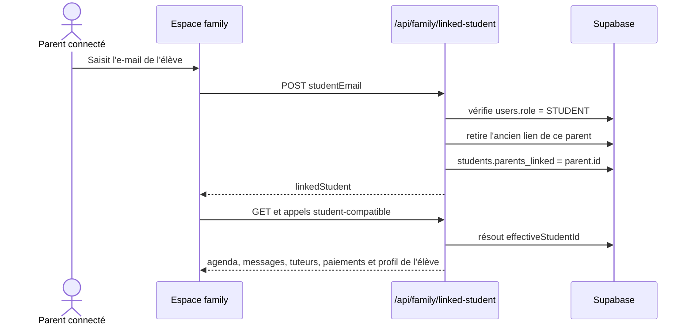
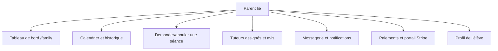

# 02 — Parent et élève lié

## Objectif

Un parent utilise l’espace `/family` pour consulter et gérer les éléments pédagogiques de son élève lié. Les routes qui acceptent un élève ou parent résolvent l’élève effectif côté serveur.

## Règles d’accès

- `GET|POST /api/family/linked-student` exigent le rôle `PARENT`.
- Un parent ne peut lier qu’un compte dont le rôle est `STUDENT`.
- L’opération réinitialise le précédent lien de ce parent avant d’enregistrer le nouveau : un parent est donc associé à un seul élève à la fois dans l’implémentation actuelle.
- `lib/student-access.ts` autorise les routes élève compatibles à travailler pour le parent sur l’`effectiveStudentId`; l’absence de liaison retourne une erreur contrôlée.

## Parcours rendus disponibles au parent

## Points de vigilance

- La liaison repose sur la connaissance de l’e-mail élève : valider avec le métier si une confirmation, un code d’invitation ou une approbation est requis.
- Les actions de paiement et de réservation doivent toujours vérifier l’élève effectif au serveur, jamais seulement l’ID fourni par l’interface.

## Tests de recette

- Parent sans élève lié : vérifier l’état vide et l’interdiction des actions nécessitant l’élève.
- Lier un compte élève existant, puis remplacer le lien : vérifier le résultat des deux côtés.
- Vérifier que le parent ne peut pas consulter un élève non lié via une URL ou un payload modifié.
