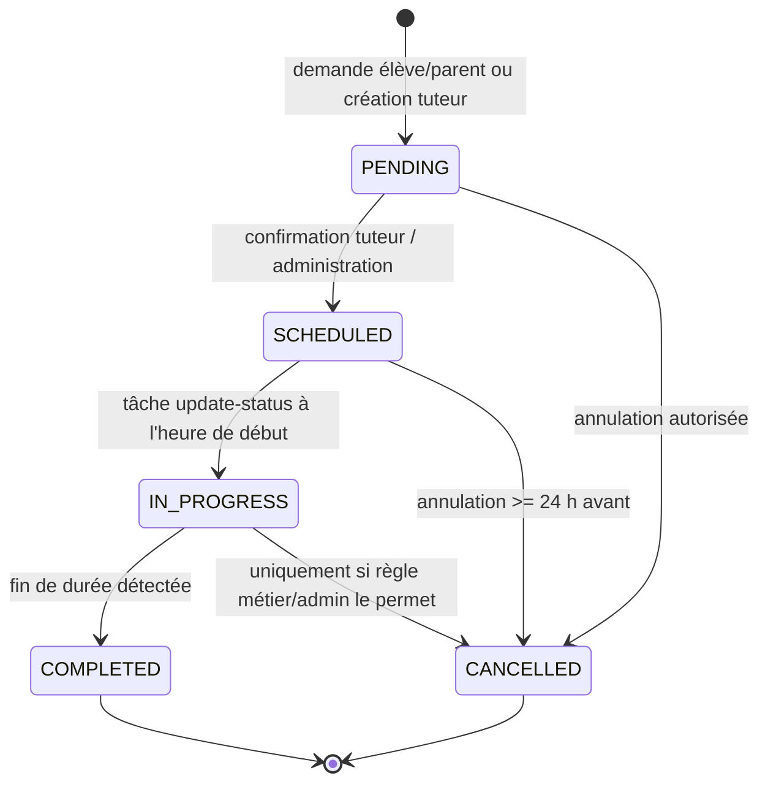
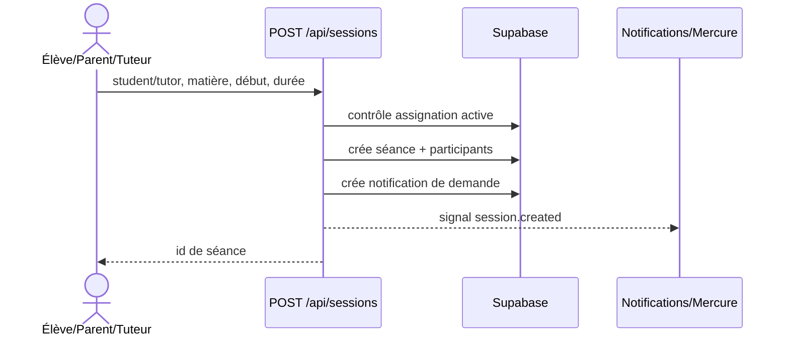
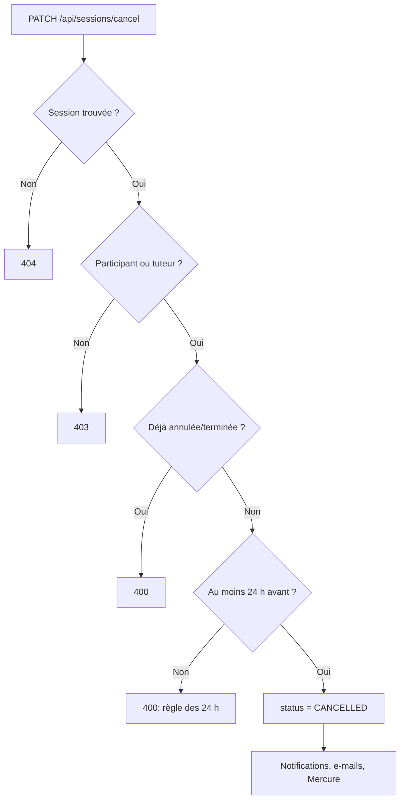

# 03 — Cycle de vie d’une séance

## Objectif

Gérer la demande, la création par tuteur, confirmation/refus, modification administrative, annulation et passage automatique des statuts.

## Création

| Initiateur | Route | Contrôles serveur | Résultat |
| --- | --- | --- | --- |
| Élève ou parent | `POST /api/sessions` | Élève effectif, tuteur assigné actif | séance `PENDING`, notification/e-mail tuteur, publication Mercure |
| Tuteur ou admin | `POST /api/sessions` | Élève(s) participants assignés au tuteur | séance `PENDING` (repli `SCHEDULED`), participants synchronisés |
| Lead public | `POST /api/leads/first-session-slots` | Créneau, matière et disponibilité tuteur | séance gratuite `TRIAL`, assignation créée |

## Confirmation, refus et modification

- Le tuteur agit via `PATCH /api/tutor/sessions/action` sur ses propres séances ; la page calendrier consomme `GET /api/tutor/sessions`.
- L’administration peut créer (`POST /api/admin/sessions`), modifier (`PUT /api/admin/sessions/:sessionId`) ou supprimer (`DELETE /api/admin/sessions/:sessionId`) une séance après contrôle admin.
- Une modification doit conserver la cohérence : tuteur/élève valides, participants synchronisés, date ISO, durée et matière valides, puis signaler le changement aux participants.

## Annulation

### Règles implémentées

- Élève participant ou tuteur peuvent annuler ; les participants additionnels sont pris en compte.
- Une séance terminée ou déjà annulée ne peut pas être annulée.
- L’annulation à moins de 24 h est refusée par la route dédiée.
- Les e-mails sont envoyés aux autres participants et les notifications contiennent la raison quand elle est fournie.

## Exécution et évaluation

- `POST /api/sessions/update-status` fait passer les séances en cours à `IN_PROGRESS` puis termine celles dont la durée est dépassée.
- Le tuteur peut enregistrer une évaluation via `POST /api/tutor/session-assessments`; l’élève consulte via `GET /api/student/assessments`.

## Tests de recette

- Créer une séance depuis chaque rôle et vérifier le contrôle d’assignation.
- Tester confirmation/refus, modification admin, annulation à J-2/J-0 et participants multiples.
- Vérifier le basculement des statuts, l’historique et les notifications sur calendrier ouvert.
