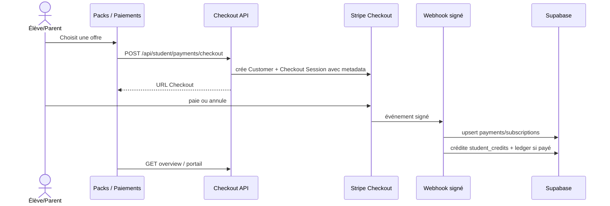
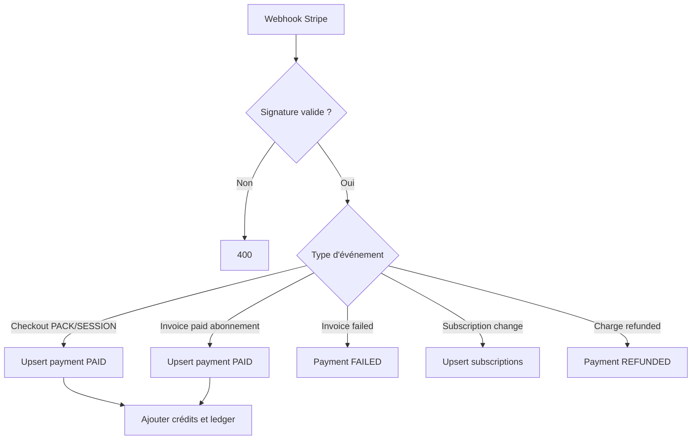

# 04 — Paiement, crédits et revenus

## Objectif

Acheter une séance, un pack ou un abonnement, suivre les crédits, présenter les factures et rendre visibles les revenus tuteur/admin.

## Checkout et crédits

- `POST /api/student/payments/checkout` exige un élève ou parent disposant d’un élève effectif et utilise le catalogue `lib/payments-catalog.ts`.
- La session Stripe transporte les métadonnées d’élève, plan, type, niveau et nombre de séances. Elles sont indispensables à la réconciliation webhook.
- `checkout.session.completed` enregistre le paiement. Pour `PACK` ou `SESSION`, les crédits sont ajoutés immédiatement ; pour `SUBSCRIPTION`, ils sont ajoutés à `invoice.paid`/`invoice.payment_succeeded`.
- `student_credit_ledger` garde la trace des variations ; `student_credits` porte le solde par niveau.

## Consultation et gestion

| Acteur | Routes | Résultat |
| --- | --- | --- |
| Élève/parent | `GET /api/student/payments/overview` | crédits, achats, abonnements et factures |
| Élève/parent | `POST /api/student/payments/portal` | URL vers le portail Stripe de gestion |
| Tuteur | `GET /api/tutor/payments/history`, `/annual`, `/payouts` | historique, récapitulatif annuel et décaissements |
| Admin | `GET /api/admin/payments` | supervision des données de paiement |

## Invariants et sécurité

- Le webhook Stripe est public mais refuse toute requête dont la signature HMAC est invalide.
- Les upserts par identifiants Stripe évitent les doublons lors des relivraisons webhook.
- Une erreur de handler renvoie `500` afin que Stripe réessaie ; surveiller les événements non traités.
- Ne jamais créditer une séance depuis le retour navigateur : seul le webhook confirmé fait foi.

## Tests de recette

- Tester checkout réussi, annulé, paiement échoué, remboursement, abonnement créé/mis à jour/annulé.
- Rejouer un même événement Stripe et vérifier qu’aucun crédit n’est ajouté deux fois.
- Vérifier les droits parent, élève, tuteur et admin sur chaque écran de paiement.
