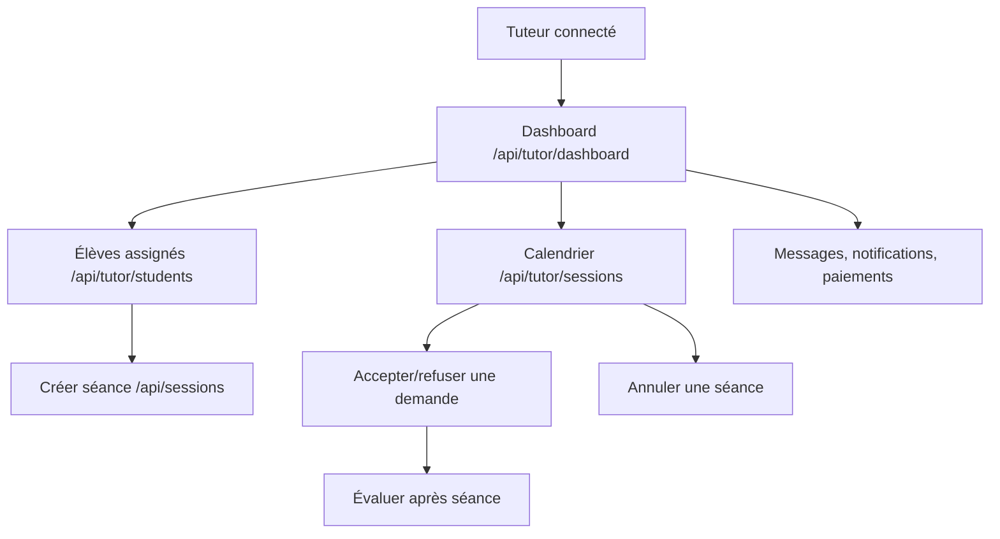
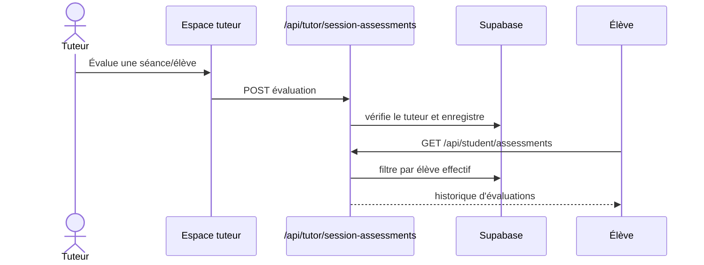

# 05 — Tuteur : gestion pédagogique

## Objectif

Permettre au tuteur de maintenir son profil, consulter ses élèves assignés, planifier et traiter ses séances, évaluer les élèves et suivre ses paiements.

## Gestion des élèves et séances

- Le tuteur voit uniquement ses élèves via `GET /api/tutor/students` et leurs séances via `GET /api/tutor/student-sessions`.
- Pour créer une séance, il fournit au moins un `studentId`; le serveur vérifie que tous les élèves (principal et additionnels) ont une assignation active avec ce tuteur.
- La demande ou création produit une notification et, quand disponible, un e-mail. Les participants de la séance sont synchronisés dans la table dédiée.
- Le tuteur utilise `PATCH /api/tutor/sessions/action` pour agir sur ses demandes ; toute transition nouvelle doit être ajoutée explicitement à ce workflow et testée.

## Évaluations

## Profil et disponibilité

- `GET|PATCH|DELETE /api/tutor/profile` gèrent les informations et préférences; `POST /api/tutor/profile/avatar` charge l’avatar dans le bucket `avatars`.
- Les matières servent à l’éligibilité aux créneaux de première séance : les garder à jour est une condition opérationnelle de réservation publique.
- La disponibilité tuteur est consultée lors de la recherche de créneaux, puis les conflits de séances `PENDING`, `SCHEDULED`, `IN_PROGRESS` sont exclus.

## Tests de recette

- Tuteur non assigné : création de séance refusée ; tuteur assigné : création et ajout de participants autorisés.
- Vérifier que les demandes apparaissent dans calendrier, notifications et e-mail.
- Créer/consulter une évaluation, modifier le profil/matières et tester l’upload d’avatar autorisé/refusé.
