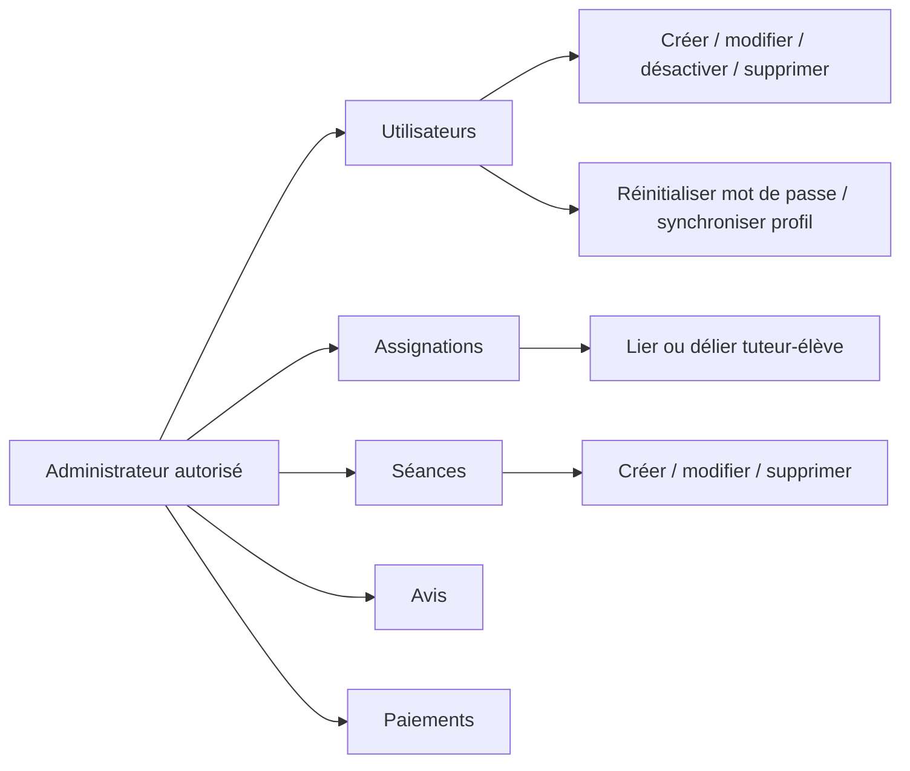
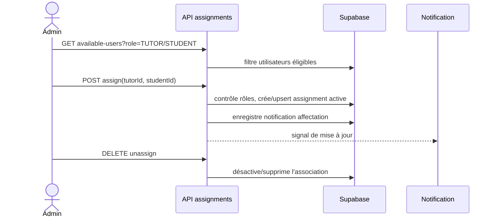

# 06 — Administration et assignations

## Objectif

L’administration est accessible aux `ADMIN` et, selon la liste contrôlée de `lib/admin-permissions.ts`, à certains tuteurs administrateurs. Elle centralise les opérations sensibles sur utilisateurs, profils, assignations, séances, avis et paiements.

## Gestion des comptes et profils

| Action | Route | Effet |
| --- | --- | --- |
| Lister | `GET /api/admin/users`, `/with-profiles` | utilisateurs et profils associés |
| Créer | `POST /api/admin/users` | compte d’un rôle autorisé ; documenter l’e-mail/identifiants remis |
| Modifier / supprimer | `PUT|DELETE /api/admin/users/:userId` | mise à jour ou suppression contrôlée |
| Activer/désactiver | `PATCH /api/admin/users/:userId/toggle-status` | état du compte |
| Réinitialiser mot de passe | `POST /api/admin/users/:userId/reset-password` | nouveau secret et notification/e-mail selon implémentation |
| Gérer profil | `PUT|POST /api/admin/users/:userId/profile` | données student/tutor |
| Réparer profils | `POST /api/admin/sync-profiles` | synchronise les profils manquants |

## Assignation tuteur–élève

### Règles

- Une assignation active est la condition préalable à la création de séance par l’élève/parent et par le tuteur.
- Toujours vérifier les rôles en base dans l’API, jamais seulement dans le modal admin.
- Les options disponibles doivent exclure les associations invalides ou inactives selon la route dédiée.

## Séances, avis et exploitation

- `GET|POST /api/admin/sessions`, `PUT|DELETE /api/admin/sessions/:sessionId` : supervision et correction des séances.
- `GET /api/admin/reviews`, `PATCH|DELETE /api/admin/reviews/:reviewId` : modération des avis affichés publiquement.
- `GET /api/admin/payments` : lecture de supervision des transactions; le webhook Stripe reste la source d’écriture des paiements.
- `GET /api/admin/resend/health` : contrôle opérationnel de l’intégration e-mail.

## Tests de recette

- Compte admin, tuteur standard et tuteur admin : vérifier précisément les droits.
- Créer un tuteur et un élève, compléter leurs profils, les assigner puis créer une séance.
- Désactiver un compte assigné, modifier/supprimer une séance et vérifier les effets de bord attendus.
