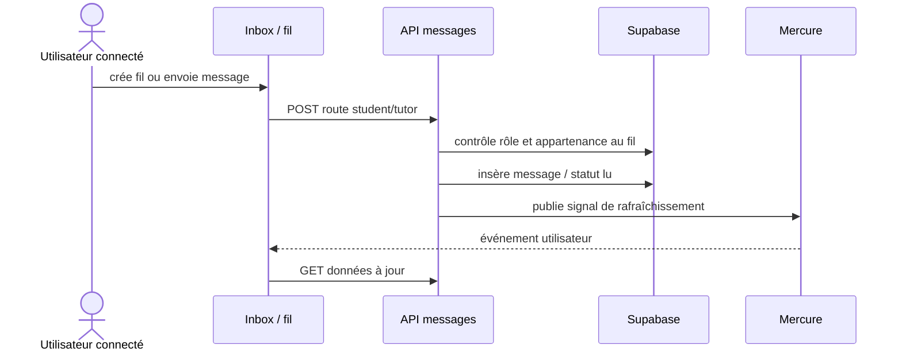
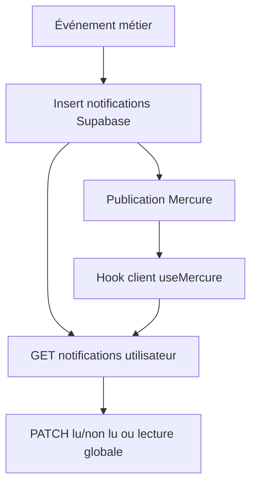

# 07 — Messagerie, notifications et temps réel

## Objectif

Fournir une messagerie entre élève/parent et tuteur, des notifications lisibles et une actualisation temps réel sans exposer les données de métier dans les événements Mercure.

## Messagerie

- Élève/parent : `GET|POST /api/student/messages`, puis `GET|POST|PATCH|DELETE /api/student/messages/:threadId`.
- Tuteur : `GET|POST /api/tutor/messages`, puis `GET|POST|PATCH|DELETE /api/tutor/messages/:threadId`.
- Le serveur doit toujours vérifier l’appartenance du participant avant lecture, écriture, édition ou suppression. Le parent passe par l’élève effectif selon `lib/student-access.ts`.
- Les hooks `useRealtimeMessageThreadsInbox` et `useRealtimeThreadMessages` rafraîchissent les données suite aux signaux.

## Notifications

| Rôle | Routes | Événements principaux |
| --- | --- | --- |
| Élève/parent | `GET|PATCH /api/student/notifications` | réservation, profil, mot de passe, messages |
| Tuteur | `GET|PATCH /api/tutor/notifications` | demande de séance, annulation, assignation |
| Tous | Mercure via `lib/mercure.ts` | signal de changement à rafraîchir |

## Règles de sécurité

- Le hub Mercure est configuré pour diffuser des signaux de rafraîchissement : ne pas y mettre de contenu privé.
- Les e-mails sont complémentaires aux notifications in-app, ils ne remplacent pas les contrôles d’autorisation.
- Les opérations d’écriture doivent rester idempotentes ou protéger les doubles clics côté interface.

## Tests de recette

- Ouvrir deux navigateurs appartenant à des rôles autorisés et vérifier la réception/réactualisation.
- Tenter d’ouvrir un fil avec un ID non autorisé et vérifier le refus.
- Marquer lu/non lu, annuler une séance et créer une assignation : vérifier badge et liste.
