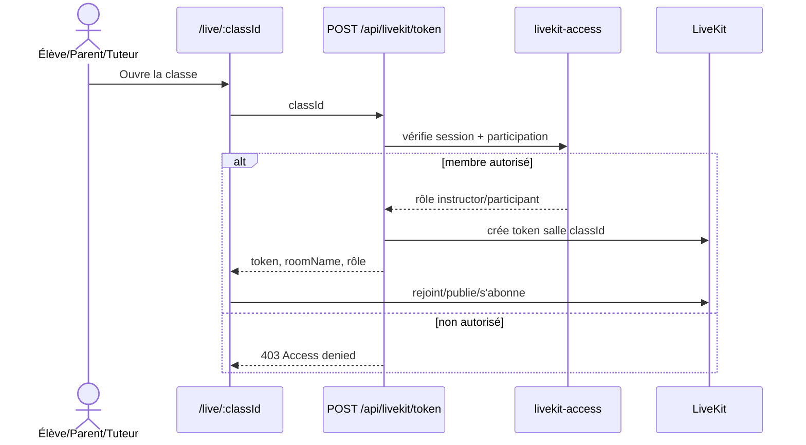

# 08 — Classe vidéo LiveKit

## Objectif

Permettre aux seuls participants d’une séance d’obtenir un jeton LiveKit pour une salle déterministe et de rejoindre la classe vidéo.

## Règles

- `POST /api/livekit/token` exige une session et un `classId` non vide.
- `resolveLiveClassMembership` est l’autorité qui établit l’appartenance ; aucun token ne doit être construit depuis un rôle fourni par le navigateur.
- `buildClassRoomName` garantit un nom de salle cohérent pour la classe.
- Les tuteurs reconnus comme `instructor` reçoivent les droits d’administration de salle ; tous les membres autorisés peuvent publier, s’abonner et envoyer des données selon l’implémentation courante.

## Tests de recette

- Élève assigné, parent lié, tuteur de la séance et utilisateur externe : vérifier les autorisations.
- Tester connexion/déconnexion, permissions micro/caméra, salon vide et jeton expiré.
- Vérifier que le lien d’une classe ne permet pas de rejoindre une autre salle.
