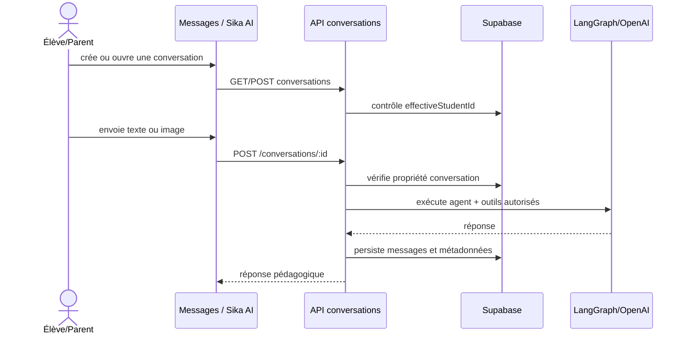

# 09 — Sika AI Tutor

## Objectif

Permettre à l’élève (et au parent agissant pour l’élève lié) de créer, poursuivre, renommer et supprimer des conversations pédagogiques avec Sika AI.

## Routes et opérations

| Opération | Route |
| --- | --- |
| Lister/créer une conversation | `GET|POST /api/student/ai-tutor/conversations` |
| Lire/envoyer dans une conversation | `GET|POST /api/student/ai-tutor/conversations/:conversationId` |
| Renommer/supprimer | `PATCH|DELETE /api/student/ai-tutor/conversations/:conversationId` |

## Règles

- La conversation appartient à l’élève effectif : un utilisateur ne peut pas deviner un ID pour accéder aux échanges d’un autre élève.
- Les prompts et outils sont définis sous `lib/ai-tutor/`; ne pas transmettre de secrets ni de données personnelles inutiles au fournisseur IA.
- Les fichiers/images doivent respecter les validations de type/taille prévues avant tout traitement vision.
- La suppression doit éliminer ou rendre inaccessible l’historique conformément à la politique de rétention.

## Tests de recette

- Créer, renommer, supprimer et rouvrir une conversation ; tester l’envoi de texte et image valide/invalide.
- Vérifier le refus entre deux élèves et l’accès via parent lié.
- Simuler erreur fournisseur et s’assurer que l’interface conserve la saisie et explique l’erreur.
