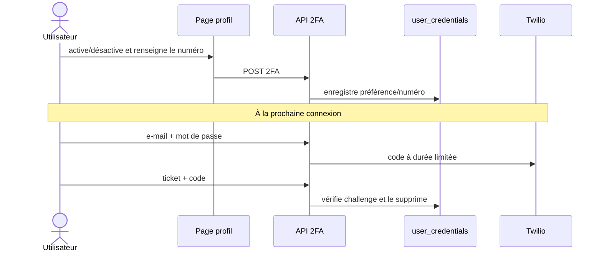

# 10 — Profil, mot de passe et 2FA

## Objectif

Permettre à chaque utilisateur de mettre à jour ses informations et de protéger son accès sans contourner les contrôles de session ou de rôle.

```mermaid
flowchart TD
  A[Utilisateur connecté] --> B{Rôle}
  B -- Élève/Parent --> C[/api/student/profile]
  B -- Tuteur --> D[/api/tutor/profile]
  C --> E[GET/PATCH profil, PATCH mot de passe, GET/POST 2FA]
  D --> F[GET/PATCH/DELETE profil, avatar, mot de passe, GET/POST 2FA]
  E --> G[Notification sécurité et session conservée selon route]
  F --> G
  G --> H[Connexion ultérieure : challenge SMS si 2FA activée]
```

## Opérations élève/parent

- `GET|PATCH /api/student/profile` lit/modifie le profil de l’élève effectif.
- `PATCH /api/student/profile/password` exige la preuve requise par la route et remplace le hash.
- `GET|POST /api/student/profile/2fa` expose et modifie l’activation SMS/numéro correspondant.
- Le parent opère sur l’élève lié lorsque la route passe par les helpers d’accès élève.

## Opérations tuteur

- `GET|PATCH|DELETE /api/tutor/profile` gère données professionnelles et préférences.
- `POST /api/tutor/profile/avatar` vérifie le fichier puis le stocke dans le bucket `avatars`.
- `PATCH /api/tutor/profile/password` et `GET|POST /api/tutor/profile/2fa` gèrent la sécurité de connexion.
- Les matières et la disponibilité doivent rester cohérentes avec la réservation publique et les assignations.

## 2FA SMS



## Tests de recette

- Modifier profil et mot de passe avec valeurs valides/invalides ; vérifier qu’un autre rôle est refusé.
- Activer 2FA avec Twilio configuré et non configuré, puis tester code erroné/expiré.
- Uploader avatar valide, type interdit et taille > limite ; vérifier le nettoyage et l’URL affichée.
