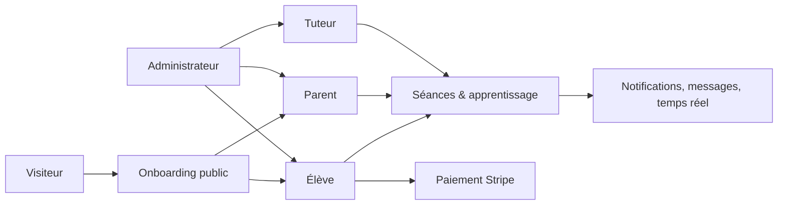

# Workflows SikaSchool

Cette documentation décrit les parcours implémentés dans le dépôt au moment de sa rédaction. Elle sert de référence pour développer, tester et faire évoluer la plateforme sans modifier implicitement les règles métier.

## Rôles et espaces

| Rôle | Espace | Responsabilités principales |
| --- | --- | --- |
| Visiteur | Site public | Découverte, demande de première séance, création de compte élève |
| Élève (`STUDENT`) | `/student` | Cours, calendrier, paiements, tuteurs, messages, IA, profil |
| Parent (`PARENT`) | `/family` | Même accès opérationnel pour l’élève lié, avec liaison parent–élève |
| Tuteur (`TUTOR`) | `/tutor` | Élèves assignés, séances, évaluations, messagerie, revenus, profil |
| Administrateur (`ADMIN`) | `/tutor/administration` | Utilisateurs, profils, assignations, séances, avis et supervision paiements |

## Carte des parcours

## Documents

1. [01 — Onboarding, inscription et connexion](01-onboarding-auth.md)
2. [02 — Parent et élève lié](02-parent-student.md)
3. [03 — Cycle de vie d’une séance](03-session-lifecycle.md)
4. [04 — Paiement, crédits et revenus](04-payments.md)
5. [05 — Tuteur : gestion pédagogique](05-tutor-workflows.md)
6. [06 — Administration et assignations](06-admin-workflows.md)
7. [07 — Messagerie, notifications et temps réel](07-messaging-notifications.md)
8. [08 — Classe vidéo LiveKit](08-live-class.md)
9. [09 — Sika AI Tutor](09-ai-tutor.md)
10. [10 — Profil, mot de passe et 2FA](10-profile-security.md)

## Conventions de lecture

- Les routes `/api/**` sont protégées par session et contrôle de rôle, sauf endpoints publics explicitement indiqués et webhook Stripe signé.
- `PENDING`, `SCHEDULED`, `IN_PROGRESS`, `COMPLETED`, `CANCELLED` désignent les statuts de séance utilisés dans le code ; vérifier les contraintes de base avant toute nouvelle transition.
- Les effets non bloquants (e-mail, notification ou publication Mercure) sont indiqués comme tels : l’opération métier principale peut réussir si l’effet secondaire échoue.
- Les diagrammes indiquent le comportement implémenté, pas une promesse produit supplémentaire.
